<h1 align="center">🩺 MedBridge</h1>

<p align="center">
  <strong>Your prescription. Finally understandable.</strong>
</p>

<p align="center">
  One Photo. One Clear Picture of Everything You're Taking.
</p>

<p align="center">
  
  
  
  
  
  
</p>

<p align="center">
  <a href="https://med-bridge-ai-two.vercel.app/"><strong>🌐 Live Prototype</strong></a> ·
  <a href="https://youtu.be/BmjmYnaEw9o?si=6Pd22Kl14DJLgNER"><strong>🎥 Video Presentation</strong></a> ·
  <a href="https://drive.google.com/file/d/1Zjnfao6HK-uS0VmVTis9ZYn1lHZ4kRx5/view?usp=drive_link"><strong>📑 Slide Deck</strong></a> ·
  <a href="https://github.com/dk-khandelwal06/MedBridge-AI"><strong>💻 Repository</strong></a>
</p>

---

MedBridge is a phone-first AI prescription clarity and medication-reconciliation companion that turns a handwritten or printed prescription into a structured, understandable medication picture — and, when a patient is also using homeopathic or traditional remedies, brings that fragmented information into one visible place.

Built for the **iQOO Hackathon 2026 — Pune Battle 02, HealthTech track**, by **Daksh Khandelwal** and **Khushi Kushwah**.

---

## 🧩 The Problem

```
📄 Hard-to-read handwritten prescription
              +
🧩 Fragmented treatment information (multiple doctors, multiple systems)
              +
❓ Uncertainty about what's actually being taken
              ↓
⚠️  Confusion for the patient
```

In India, a prescription is written for the doctor and the pharmacist — the patient is often the last person who can actually read it. It gets harder still when a patient is also seeing a second practitioner, or logging a homeopathic or home remedy for the same complaint, without either side having the full picture. MedBridge doesn't diagnose that gap — it makes it visible.

---

## ✨ The Solution

| | Capability | What it does |
|---|---|---|
| 📸 | **Photo** | Capture any paper prescription instantly with the phone camera — no scanning, no manual entry |
| 🧠 | **Explain** | AI turns extracted medical shorthand into plain language, with bilingual (English/Hindi) voice read-aloud |
| 📅 | **Organize** | Every medicine becomes a clear, timed medication timeline with adherence tracking |
| 🔗 | **Reconcile** | Allopathic and homeopathic/home-remedy logs are brought together, with same-symptom overlaps surfaced as a gentle disclosure prompt |

---

## 🔄 Core Product Workflow

```
Prescription Image
        ↓
AI Vision / OCR  (Google Gemini 1.5 Flash multimodal)
        ↓
Structured Extraction  (medicine · dose · frequency · duration)
        ↓
Confidence Gate  (low-confidence fields flagged, not guessed)
        ↓
User Verification
        ↓
Plain-Language Explanation + Voice
        ↓
Medication Timeline
        ↓
Cross-System Reconciliation
        ↓
One Clear Medication Picture
```

**AI doesn't silently guess.** Every extracted field carries a confidence score; anything below the confidence threshold is routed back to the user for a quick review instead of being trusted blindly.

| Confidence | Behavior |
|---|---|
| 🟢 High | Accepted directly into the medication record |
| 🟡 Medium | Shown for a quick review |
| 🔴 Low | User must verify before it's used |

---

## 🧠 AI Pipeline

MedBridge's extraction pipeline is implemented in [`src/services/gemini.ts`](src/services/gemini.ts):

1. **Capture** — prescription image (camera or gallery upload) is base64-encoded in the browser.
2. **Vision extraction** — the image is sent to the **Google Gemini 1.5 Flash multimodal API** with a structured prompt that requests doctor/clinic/patient metadata and a per-medicine schema (name, dose, frequency, duration, instructions, confidence, raw handwriting snippet), with `responseMimeType: "application/json"` so the model returns structured data rather than free text.
3. **Normalization** — [`src/services/normalization.ts`](src/services/normalization.ts) matches extracted medicine names (including common misspellings/aliases) against a small curated medicine knowledge base, correcting OCR noise and attaching category, standard dosage, frequency, and bilingual (English/Hindi) explanations.
4. **Confidence gating** — items below a confidence threshold are marked `needsConfirmation` and surfaced for review rather than silently accepted.
5. **Structuring** — confirmed data is assembled into a typed `Prescription` object (see [`src/types/index.ts`](src/types/index.ts)) with an expanded, human-readable dosage schedule.
6. **Explanation + voice** — [`src/services/speech.ts`](src/services/speech.ts) uses the browser's **Web Speech API** to read explanations aloud in English or Hindi, selecting an appropriate voice where available.
7. **Reconciliation** — the reconciliation engine compares symptoms/targets across the allopathic and homeopathic/home-remedy logs and raises a clearly worded overlap notice — never an interaction or safety claim.
8. **Graceful fallback** — if no API key is configured or the live call fails, the app falls back smoothly to a high-fidelity curated demo dataset ([`src/data/mockData.ts`](src/data/mockData.ts)) so the product is always demonstrable.

---

## 📱 Why the Phone Matters

> *"The input already exists in the patient's hand."*

| | |
|---|---|
| 📷 **Camera** | Capture a paper prescription instantly — no scanner, no manual typing |
| 🎙️ **Voice** | Hear medicine explanations spoken aloud in Hindi or English |
| 🧠 **AI** | Understand messy, handwritten medical notation on the spot |
| 🎒 **Portability** | Carry one medication picture anywhere — clinic, pharmacy, home |

MedBridge isn't a dashboard that happens to run on mobile — the entire interaction begins with a physical prescription and a phone camera in a patient's or caregiver's hand.

---

## 🔗 Cross-System Treatment Reconciliation

This is MedBridge's signature differentiator.

Patients in India frequently consult both allopathic physicians and traditional/homeopathic practitioners — often without either side knowing about the other. MedBridge lets a user optionally log a homeopathic or home remedy alongside their allopathic prescription. When both logs appear to target the same symptom, MedBridge raises a clear, non-alarming disclosure prompt:

> *"You are currently taking Allopathic prescription medications targeting [symptom], alongside a Homeopathic remedy intended for related relief."*

**What this feature is:** an information-visibility and disclosure-reminder tool.
**What this feature is not:** a diagnostic engine, an interaction checker, or a recommendation to start, stop, or choose any treatment.

Every homeopathic/traditional entry is clearly labeled:

> ⚠️ **Traditional / educational information only — not medical advice.**

---

## 🛡️ Safety by Design

**"MedBridge explains. It never decides."**

<table>
<tr>
<td valign="top" width="50%">

### ✅ MedBridge Does
- Read and segment handwritten prescriptions
- Extract structured medicine, dose, frequency, and duration
- Translate medical shorthand (`1-0-1`, SOS, AC, HS) into plain English & Hindi
- Make extraction confidence transparent
- Organize medications into a clear timeline
- Surface uncertainty for user confirmation
- Encourage disclosure across treatment systems

</td>
<td valign="top" width="50%">

### ❌ MedBridge Does Not
- Diagnose any condition
- Prescribe or alter medication
- Tell a user to start or stop a medicine
- Replace a qualified medical professional
- Make medical decisions on the user's behalf
- Claim clinical equivalence between allopathic and homeopathic treatment

</td>
</tr>
</table>

MedBridge is a hackathon prototype for demonstration and educational purposes. AI-extracted information should always be verified against the original prescription and with a qualified healthcare professional.

---

## 🖥️ Product Screens

### Living Prescription Canvas
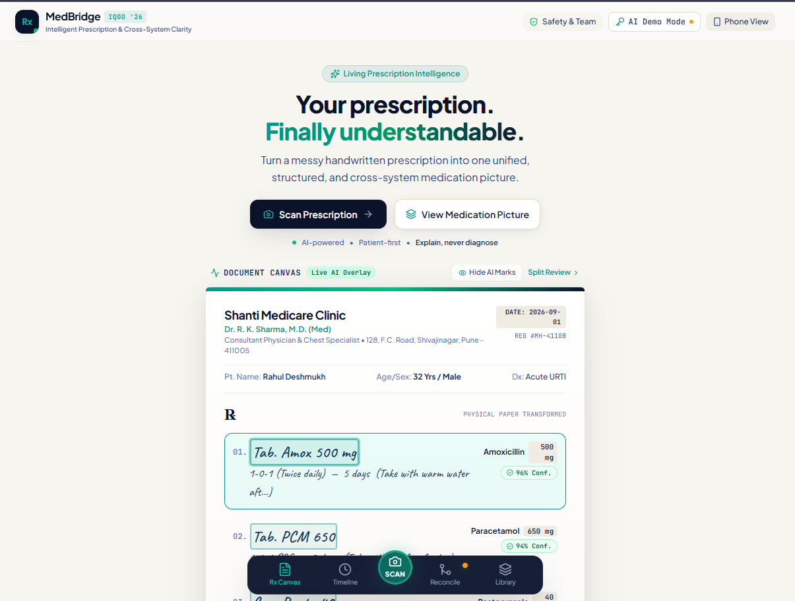
The prescription itself becomes an interactive canvas — handwriting, AI confidence overlays (96%, 94%...), and a bottom navigation across Rx Canvas, Timeline, Scan, Reconcile, and Library.

### 🔗 Cross-System Reconciliation
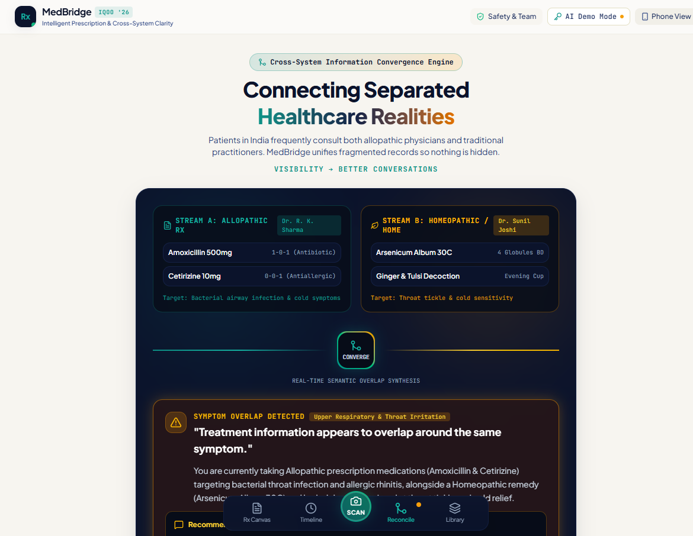
Allopathic and homeopathic/home-remedy streams converge into a single view, surfacing a same-symptom overlap notice and a prompt to mention it to both practitioners.

### 📅 Medication Timeline
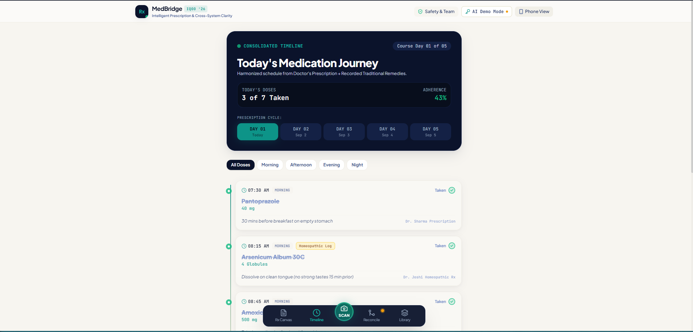
A consolidated, day-by-day dosing schedule blending the doctor's prescription with any recorded traditional remedies, with adherence tracking.

### 📚 Treatment Library
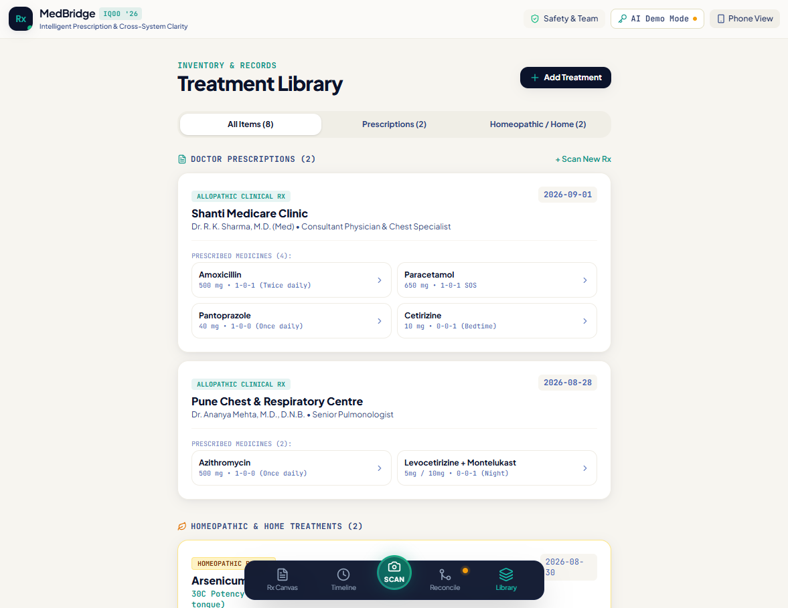
A single inventory of every recorded treatment, categorized by source (allopathic prescription vs. homeopathic/home remedy).

### 📱 Mobile Experience

The same phone-first experience, framed in a device simulator for demo purposes.

---

## 🎞️ Presentation Walkthrough

The full deck is available as a [PDF](slides/MedBridge_Slide_Deck.pdf) and [PPTX](slides/MedBridge_Slide_Deck.pptx). Highlights below.

### Slide 01 — MedBridge
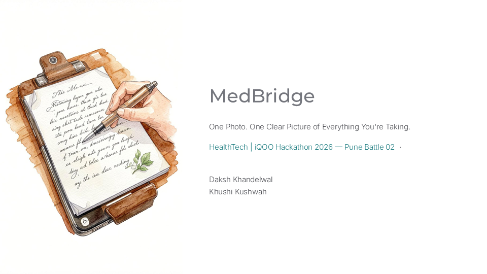

**What it communicates:** Introduces MedBridge and its core proposition — "One Photo. One Clear Picture of Everything You're Taking."

### Slide 02 — Can you read what your doctor wrote?
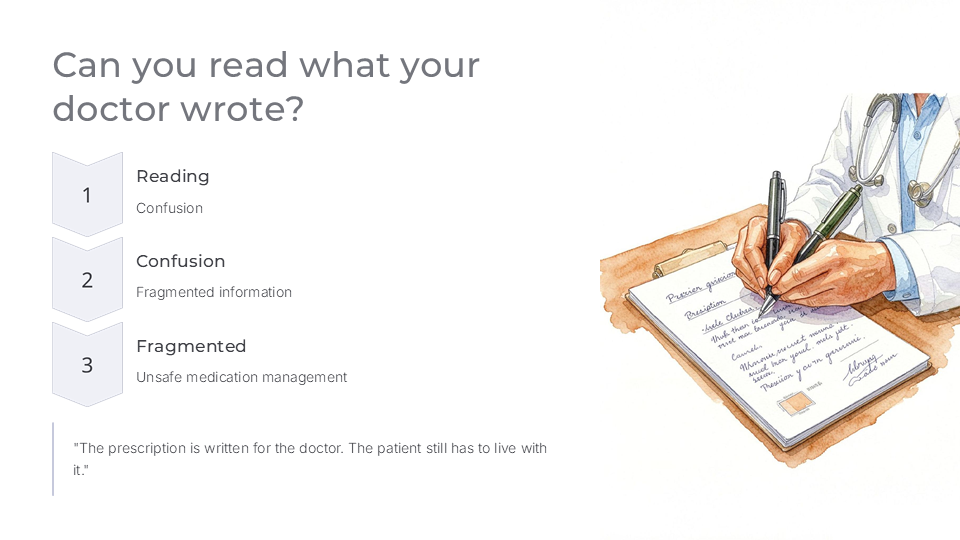

**What it communicates:** Frames the handwritten-prescription problem — reading confusion leads to fragmented information and unsafe medication management.

### Slide 03 — The problem doesn't end with the prescription
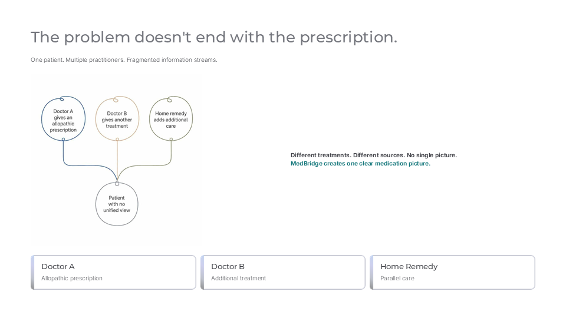

**What it communicates:** One patient can receive care from multiple doctors and home remedies, each a separate information stream, with no unified picture — the gap MedBridge closes.

### Slide 04 — Meet MedBridge
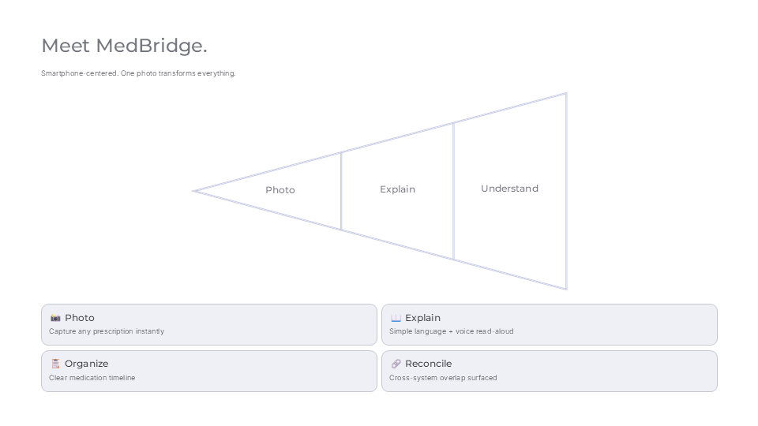

**What it communicates:** The four-part product flow — Photo, Explain, Organize, Reconcile.

### Slide 05 — Not a chatbot. A multi-stage AI pipeline
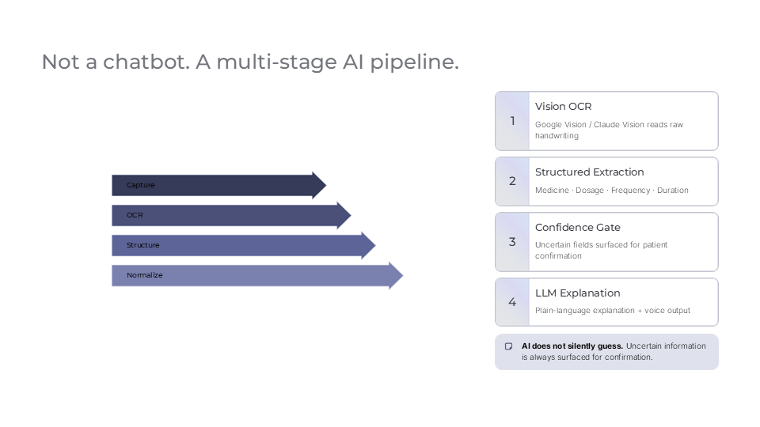

**What it communicates:** Capture → OCR → Structure → Normalize, with a confidence gate before any explanation is generated — "AI does not silently guess."

### Slide 06 — Why the phone matters
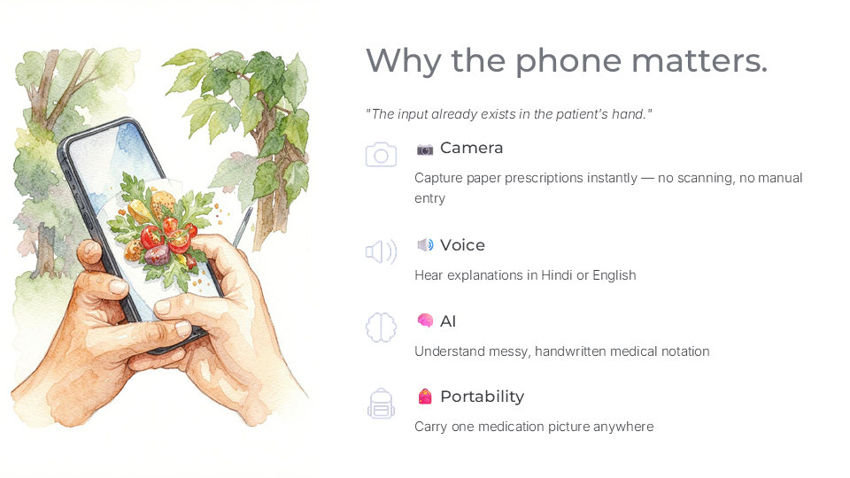

**What it communicates:** Camera, voice, AI, and portability make the phone the essential entry point, not just the screen the app runs on.

### Slide 07 — One patient. Multiple systems. One visible picture
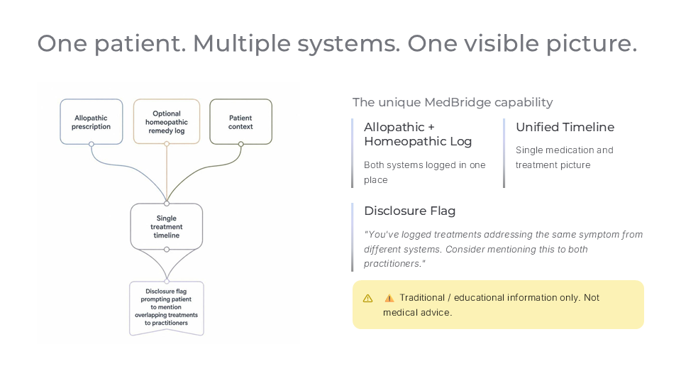

**What it communicates:** The signature differentiator — allopathic and optional homeopathic logs converge into a single timeline with a disclosure flag, clearly labeled as traditional/educational information only.

### Slide 08 — MedBridge explains. It never decides
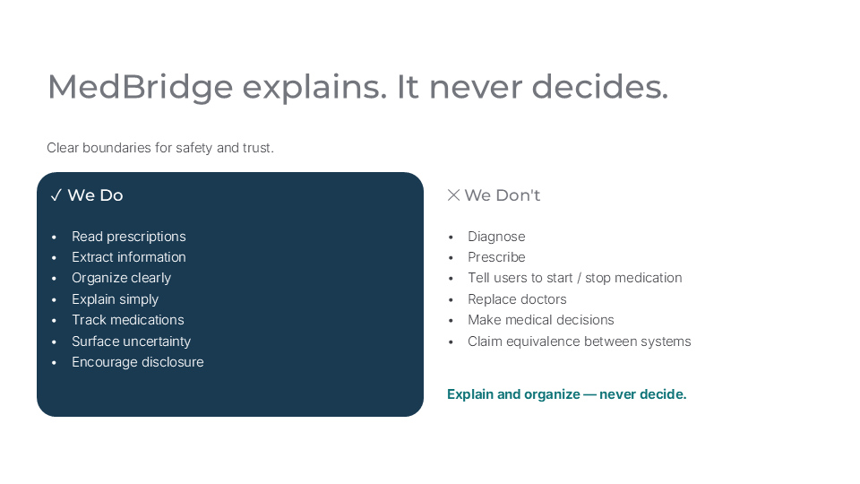

**What it communicates:** The safety boundary — a "We Do" vs. "We Don't" matrix that keeps the product firmly in explain-and-organize territory.

### Slide 09 — Built for the hackathon. Designed for real life
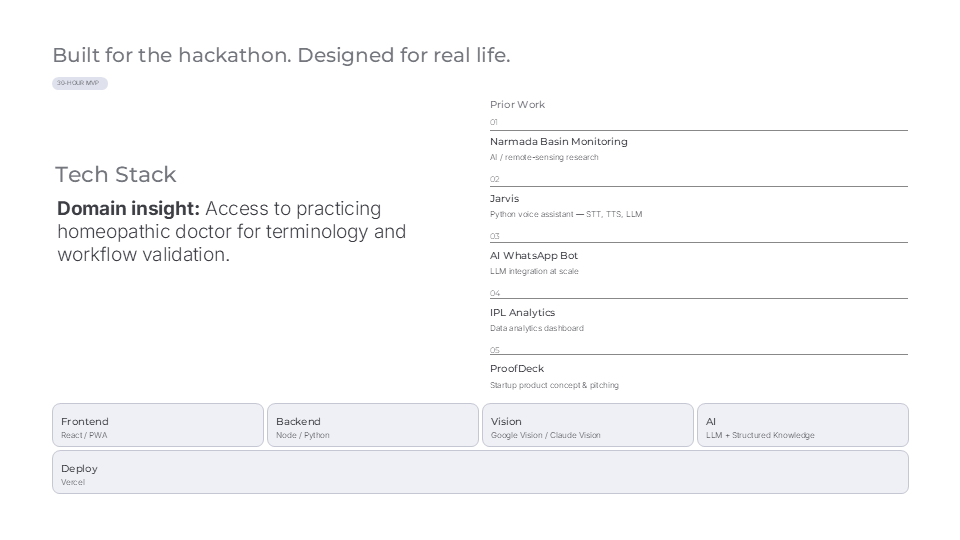

**What it communicates:** The tech stack, the team's prior work, and the domain-access advantage of a practicing homeopathic doctor for terminology validation.

### Slide 10 — Nothing gets lost
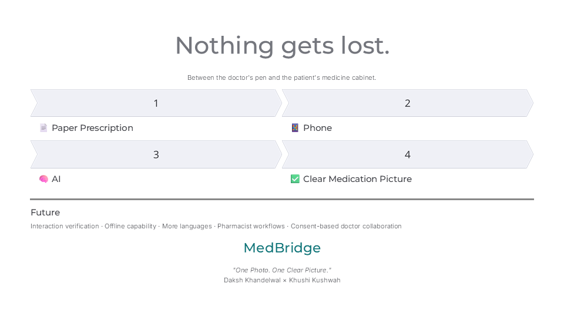

**What it communicates:** The closing line — "Nothing gets lost between the doctor's pen and the patient's medicine cabinet" — plus the future roadmap.

---

## 🎥 Demo

Watch the complete MedBridge presentation and live product walkthrough:

**▶️ [Watch on YouTube](https://youtu.be/BmjmYnaEw9o?si=6Pd22Kl14DJLgNER)**

## 🌐 Try the Prototype

Explore the working MedBridge prototype and experience the prescription-to-medication-picture workflow yourself:

**🔗 [med-bridge-ai-two.vercel.app](https://med-bridge-ai-two.vercel.app/)**

---

## 🏆 Built for iQOO Hackathon 2026

**Battle 02 — Pune · Track: HealthTech**

MedBridge was developed as a HealthTech hackathon prototype focused on prescription understanding and cross-system treatment-information visibility.

---

## 🛠️ Technology Stack

| Layer | Technology |
|---|---|
| **Frontend** | React 19, TypeScript, Vite |
| **Styling** | Tailwind CSS v4 |
| **Icons / Effects** | Lucide React, Canvas Confetti |
| **Multimodal AI** | Google Gemini 1.5 Flash Vision API, with a graceful high-fidelity demo-dataset fallback |
| **Voice** | Web Speech API (`en-US`/`en-IN` and `hi-IN`) |
| **Deployment** | Vercel (SPA rewrites configured via `vercel.json`) |

## 🏗️ Architecture

```
User
 ↓
Mobile / Web Interface (React + Tailwind)
 ↓
Prescription Capture (camera / gallery)
 ↓
AI Vision — Google Gemini 1.5 Flash multimodal
 ↓
Structured Extraction + Normalization
 ↓
Confidence Gate & User Verification
 ↓
Medicine Intelligence (plain-language + bilingual voice)
 ↓
Medication Timeline
 ↓
Treatment Library
 ↓
Cross-System Reconciliation
```

MedBridge is a client-side application — there is no backend server or database in this prototype. Prescription images are processed in the browser and sent directly to the Gemini API for analysis; nothing is permanently stored server-side.

---

## 🔒 Privacy & Security

- API keys are read from the `VITE_GEMINI_API_KEY` environment variable, or entered locally via the in-app key modal (stored only in the browser's `localStorage`) — never hardcoded.
- `.env` and `.env.local` files are excluded via `.gitignore` — never commit a real API key.
- Health information is sensitive; this is a prototype, and no data is transmitted anywhere beyond the direct Gemini API call needed for extraction.

---

## 🚀 Installation

```bash
git clone https://github.com/dk-khandelwal06/MedBridge-AI.git
cd MedBridge-AI
npm install
```

### Environment variables (optional)

To use a live Gemini key instead of the built-in demo dataset, create a `.env` file:

```
VITE_GEMINI_API_KEY=your_api_key_here
```

Without a key, MedBridge runs fully on its curated high-fidelity demo dataset — the app is always demonstrable.

### Run locally

```bash
npm run dev
```

Open [http://localhost:5173](http://localhost:5173).

### Production build

```bash
npm run build
npm run preview
```

## 🌐 Deployment

The repository includes a `vercel.json` with SPA rewrite rules and is deployed at [med-bridge-ai-two.vercel.app](https://med-bridge-ai-two.vercel.app/). To deploy your own copy: import the repository into [Vercel](https://vercel.com), optionally set `VITE_GEMINI_API_KEY` under Environment Variables, and deploy.

---

## 📂 Project Structure

```
MedBridge-AI/
├── public/
│   ├── favicon.svg
│   └── icons.svg
├── src/
│   ├── assets/               # hero image, react/vite logos
│   ├── components/           # PrescriptionCanvas, ScannerModal, ExtractionReview,
│   │                         # MedicineIntelligence, MedicationTimeline,
│   │                         # TreatmentLibrary, CrossSystemReconciliation,
│   │                         # MedicationPicture, SafetyMatrix, and more
│   ├── data/
│   │   └── mockData.ts       # curated demo prescriptions & knowledge base
│   ├── services/
│   │   ├── gemini.ts         # Gemini multimodal extraction pipeline
│   │   ├── normalization.ts  # medicine name normalization & knowledge base
│   │   └── speech.ts         # bilingual voice read-aloud
│   ├── types/
│   │   └── index.ts          # shared TypeScript types
│   ├── App.tsx
│   └── main.tsx
├── slides/
│   ├── images/                # 10 pitch-deck slide exports
│   ├── website_images/        # product screenshots
│   ├── MedBridge_Slide_Deck.pdf
│   └── MedBridge_Slide_Deck.pptx
├── package.json
├── vercel.json
├── LICENSE
└── README.md
```

---

## 👥 Team

<table>
<tr>
<td valign="top" width="50%">

### Daksh Khandelwal
**2nd Year · B.S. in AI & Data Science · IIT Jodhpur**

📧 dk.khandelwaliit@gmail.com
💼 [LinkedIn](https://www.linkedin.com/in/daksh-khandelwal-b02748391/)
💻 [GitHub](https://github.com/dk-khandelwal06)

</td>
<td valign="top" width="50%">

### Khushi Kushwah
**2nd Year · B.S. in AI & Data Science · IIT Jodhpur**

📧 khushikushwah213@gmail.com
💻 [GitHub](https://github.com/khushikushwah213)

</td>
</tr>
</table>

### Prior Work

- **Jarvis** — Python voice assistant with speech-to-text, text-to-speech, and LLM-driven command handling
- **AI WhatsApp Automation** — LLM-integrated WhatsApp Web automation bot
- **IPL Performance Analytics** — Excel/VBA data-analytics dashboard
- **ProofDeck** — an original startup concept and pitch, connecting resume claims to real project evidence
- **Narmada Basin Monitoring & Governance** — AI/remote-sensing research work

---

## 📄 License

This project is available under the **MIT License** — see [LICENSE](LICENSE) for details.

---

## ⚠️ Disclaimer

MedBridge is a prototype developed for hackathon demonstration and educational purposes. It is **not** a medical device, diagnostic system, prescription service, or substitute for professional medical advice. AI-generated or extracted information should always be verified against the original prescription and with a qualified healthcare professional.

---

<h2 align="center">🩺 From Paper to Clarity</h2>

<p align="center">
  <strong>Nothing gets lost between the doctor's pen and the patient's medicine cabinet.</strong>
</p>

<p align="center">
  One Photo. One Clear Picture of Everything You're Taking.
</p>

<p align="center">
  <a href="https://med-bridge-ai-two.vercel.app/">🌐 Live Prototype</a> ·
  <a href="https://youtu.be/BmjmYnaEw9o?si=6Pd22Kl14DJLgNER">🎥 Watch Demo</a> ·
  <a href="https://drive.google.com/file/d/1Zjnfao6HK-uS0VmVTis9ZYn1lHZ4kRx5/view?usp=drive_link">📑 View Deck</a> ·
  <a href="https://github.com/dk-khandelwal06/MedBridge-AI">💻 View Source</a>
</p>
